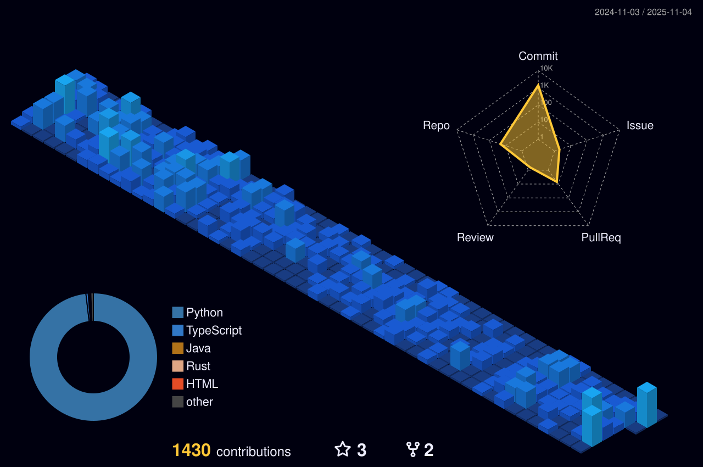

<h1 align="center">- Full Stack Software Archaeologist -</h1>
<h4 align="center">
  Played an integral role in putting digital vision into reality with world-class software building 
from scratch,  
maintaining or scaling existing products including <b>Retail</b>, <b>E-Commerce</b>, <b>Logistics</b>, 
<b>Banking and Finance</b>, <b>Healthcare</b>, <b>Media and Entertainment</b>, <b>Game Development</b>.
</h4>

  

<h2 align="center">Skill Set</h2>

#### &#10029; AI/ML  
&nbsp;&nbsp;&nbsp;&nbsp;&#9989; NLP, NLU, RAG, STS, TTS, YOLO, LSTM, GRU, MOE, Model Training 
&nbsp;&nbsp;&nbsp;&nbsp;&#9989; PyTorch, TensorFlow, Keras, PySpark, LangChain, LangGraph 
&nbsp;&nbsp;&nbsp;&nbsp;&#9989; OpenAI, LLM, LoRA, SageMaker, TensorRT 
&nbsp;&nbsp;&nbsp;&nbsp;&#9989; Scalable Data Pipelines, GPU Optimization, RTB 

#### &#10029; Blockchain  
&nbsp;&nbsp;&nbsp;&nbsp;&#9989; Ethereum/EVM, Cosmos SDK/Tendermint, Polkadot/Substrate, Hyperledger Fabric 
&nbsp;&nbsp;&nbsp;&nbsp;&#9989; ECC, SHA-256, Keccak-256, ECDSA, ZKP, HSMs, Vault, MPC 
&nbsp;&nbsp;&nbsp;&nbsp;&#9989; PoW, PoS, Delegated PoS, PoH, PoA, PoI, BFT, Rollups, Plasma, State Channels 
&nbsp;&nbsp;&nbsp;&nbsp;&#9989; Gossip protocols, libp2p 
&nbsp;&nbsp;&nbsp;&nbsp;&#9989; Solidity, Rust, Move 
&nbsp;&nbsp;&nbsp;&nbsp;&#9989; ERC-20, ERC-721, ERC-1155, SPL tokens 
&nbsp;&nbsp;&nbsp;&nbsp;&#9989; Reentrancy Protection, Gas Optimization, Formal Verification 

#### &#10029; Frontend  
&nbsp;&nbsp;&nbsp;&nbsp;&#9989; Javascript, Typescript  
&nbsp;&nbsp;&nbsp;&nbsp;&#9989; HTML, CSS, SCSS, SASS  
&nbsp;&nbsp;&nbsp;&nbsp;&#9989; Tailwind CSS, Bootstrap, Material-UI, Chakra-UI, Headless-UI  
&nbsp;&nbsp;&nbsp;&nbsp;&#9989; React, React Native, Next.js, Gatsby.js, Electron, Vue, Angular  
&nbsp;&nbsp;&nbsp;&nbsp;&#9989; Redux, Redux-Saga, Redux-thunk, RESTful, GraphQL API, Web3.js, Ethers.js  

#### &#10029; Backend  
&nbsp;&nbsp;&nbsp;&nbsp;&#9989; Django, Flask, Rocket, Actix, .NET, Spring Boot, Node, Express 
&nbsp;&nbsp;&nbsp;&nbsp;&#9989; Ruby on Rails, Elixir, Phoenix  
&nbsp;&nbsp;&nbsp;&nbsp;&#9989; KeystoneJS, Contentful, Strapi, Prismic  
&nbsp;&nbsp;&nbsp;&nbsp;&#9989; MySQL, MSSQL, PostgreSQL, MongoDB, CouchDB, GraphDB, VectorDB 

#### &#10029; Cloud service, DevOps, and others  
&nbsp;&nbsp;&nbsp;&nbsp;&#9989; AWS (Lambda, S3, EC2, Amplify, DynamoDB, Codebuild, Codepipeline, RDS, Cogniter, Route53, CloudFront, VPC)  
&nbsp;&nbsp;&nbsp;&nbsp;&#9989; Firebase, Elastic Search, Meili Search, Algoria Search  
&nbsp;&nbsp;&nbsp;&nbsp;&#9989; Nginx, Apache, GCP, Linux  
&nbsp;&nbsp;&nbsp;&nbsp;&#9989; Azure, Docker, Terraform, EKS, Jenkins  
&nbsp;&nbsp;&nbsp;&nbsp;&#9989; Twilio, Mailchimp, Mailgun, Sendgrid  
&nbsp;&nbsp;&nbsp;&nbsp;&#9989; Elastic Search, Algolia  
&nbsp;&nbsp;&nbsp;&nbsp;&#9989; Cypress, Jest, Mocha, Chai, Unit test  
&nbsp;&nbsp;&nbsp;&nbsp;&#9989; Jira, Pivotal, Trello, Asana  
&nbsp;&nbsp;&nbsp;&nbsp;&#9989; Github, Gitlab, Bitbucket  
	

## 🔥 Streak Stats

  
  

  &nbsp;&nbsp;

---

### 📈 **GitHub Analytics**

